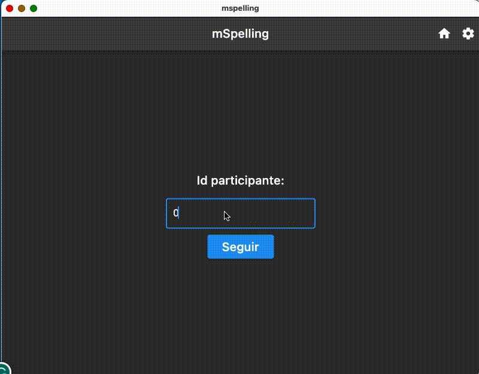

# mSpelling

Measure of Spanish spelling skills

* GitHub repo: <https://github.com/mario-bermonti/mspelling.git>
* Documentation: <https://mspelling.readthedocs.io/>
* Free software: GNU General Public License v3

## Features
- Developed specifically for research on spelling skills
- Easy to administer
- Flexible and easy to extend
- Supports multiple platforms: MacOS, Windows, Linux
- Results are saved to a CSV file

## Description

Words are presented by the computer one at a time and the participant types the word
using the keyboard. Participants have a rest period after every 5 trials.

At the end of the session, mspelling saves the results to a CSV file, which is supported
by most popular spreadsheet software these days (e.g., Excel).

mSpelling is developed using the Python programming language v3.

## Getting Started
Please see [mSpelling documentation][project_docs] for details about how to install and use mSpelling.

## Contributing to this project
  All contributions are welcome!

  Will find a detailed description of all the ways you can contribute to mspelling in
  [the contributing guide][contributing_guide].

  This is a beginner-friendly project so don't hesitate to ask any questions or get in touch
  with the project's maintainers.

  Please review the [project's code of conduct][code_conduct] before making
  any contributions.

## Author
This project was developed by Mario E. Bermonti-Pérez as part of
his academic research. Feel free to contact me at [mbermonti@psm.edu](mailto:mbermonti@psm.edu) or
[mbermonti1132@gmail.com](mailto:mbermonti1132@gmail.com)

## Credits

This package was created with [Cookiecutter][cookiecutter] and the [mario-bermonti/cookiecutter-modern-pypackage][cookiecutter-modern-pypackage] project template.

[cookiecutter]: https://github.com/cookiecutter/cookiecutter
[cookiecutter-modern-pypackage]: https://github.com/mario-bermonti/cookiecutter-modern-pypackage
[project_docs]: https://mspelling.readthedocs.io/
[code_conduct]: ./CODE_OF_CONDUCT.md
[contributing_guide]: ./contributing.md
