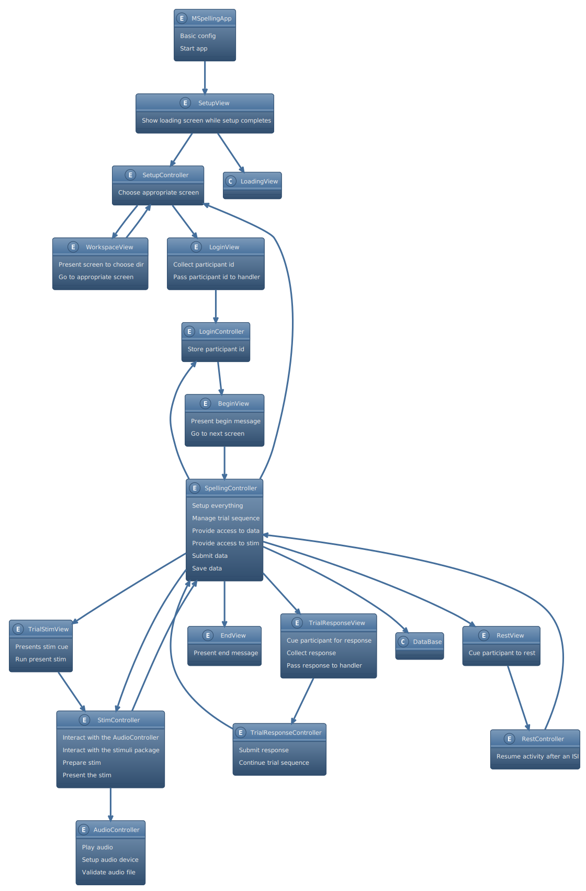

======
Design 
======

Requirements
============

General - basic app
-------------------
- Present various screens with messages to the user so he or she knows
  what is happening at each moment.
- Collect participant's id 
- Allow configuration through config files and gui 

Spelling activity
-----------------
- Allow practice and experimental sessions
- Present audio stimuli
- Allow response from keyboard
- Don't allow responses until 1s after stimuli presentation
- Users need to provide the stimuli
- Read stimuli from file
- Allow users to select where the stimuli are stored
- Allow users to select if stimuli should be presented sequentially or randomly

Data
----
- Don't save partial data; only data from completed sessions
- Use the participant's id to identify participants data
- Collect data about trials, session, and device
- Integrate all data into a single table 
- Save data to disk as CSV file

Components and responsibilities
====================================

